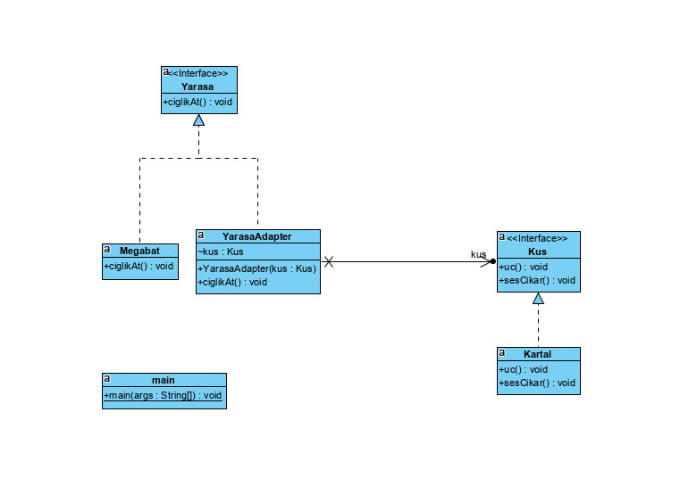

#Adapter Pattern

Nedir?

Adapter tasarım deseni, structural tasarım desenlerinden biridir. Bu tasarım deseni, birbiriyle ilişkili olmayan interface'lerin birlikte çalışmasını sağlar. Bu işlemi ise, bir sınıfın interface'ini diğer bir interface'e dönüştürerek yapar.

Adapter tasarım deseni ismini gerçek hayattaki adaptörlerden almıştır. Örneğin, telefon şarz cihazı bir adaptördür. 240V'luk gerilimi 5V'a dönüştürür. Mobil şarz cihazı, mobil şarz soketi ile duvar soketi arasında bir adaptör görevi görür.

Ne zaman Kullanılır?

Farklı interface'lere sahip sınıfların birbiriyle çalışabilmesini sağlamak amacıyla kullanılır. Örnek vermek gerekirse, bir XML dosyasının Document Object Model interface'ini, bir ağaç yapısına dönüştürülmesi için kullanılabilir.

Nasıl Kullanılır?

Var olan sistemin interface'i, target interface olarak adlandırılır. Bu interface'i implement edecek bir Adapter sınıfı yaratılır. Adapter sınıfında, Adaptee interface türünden bir sınıf değişkeni bulunur. Son olarak client sınıfı Adapter sınıfı nesnesi ve Adaptee nesnesini yaratır.

Daha iyi anlamak için şöyle bir örnek verelim: Matematik işlemleri yapan bir modülümüz olsun. Bu modüle String işlemleri yapan bir modül eklemek istiyoruz. String modülü içerisinde spesifik işlemleri yapan sınıflar bulunacak. Bu işlemi yaparken var olan modülün değiştirilmemesi gerekir. Örneğimizdeki var olan modülü Target interface temsil etmektedir. String modülünü Adaptee interface'i, bu ikisi arasındaki ilişkiyi ise Adapter sınıfı sağlamaktadır. String modülü içerisindeki sınıflar ise Adaptee interface implement eden sınıflardır.

Faydaları Nedir?

1. Birbiriyle ilişkili olmayan interface'lerin birlikte çalışmasını sağlar.
2. Kodların yeniden yazılması engeller.
3. Var olan modül(ler) değiştirilmeden sisteme yeni modüller eklenebilir.

Tasarımda ne yaptım?

Kuşa özel sesCikar() fonksiyonunu, Adabter Class'ın içinde yarasalara ait ciglikAt() fonksiyonu ile değiştirdim. Böylece yarasalara ait olmayan bir özelliği, adapter tasarımı ile kullanmış olduk.

Tasarım Desenine Ait Class Diagramı

[Tasarım Modeli Açıklama Kaynağı](https://www.codesenior.com/tutorial/Adaptor-Adapter-Tasarim-Deseni)
